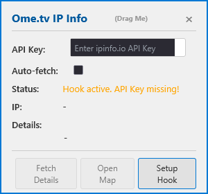

# Ome.tv IP Info Tool

A Tampermonkey userscript that displays IP and location info (including organization) for Ome.tv users. It provides a fixed-size, draggable UI overlay with manual WebRTC hook setup. The script is intended for educational purposes only.

## Disclaimer

**This project is for educational purposes only.**

The authors and contributors of this code are **not responsible for any misuse or illegal activity** that results from using this script. Use this tool responsibly and respect the privacy and rights of others. By using this script, you agree that you are solely responsible for your actions.

## Features
- Shows peer IP and location details on Ome.tv
- Draggable, fixed-size overlay UI
- Manual and automatic IP info fetching
- Requires a free API key from [ipinfo.io](https://ipinfo.io/)

## Usage

1. **Install Tampermonkey** (or a compatible userscript manager) in your browser. (Or just manually add the script via console)
2. **Add this script** (`main.js`) to Tampermonkey.
3. **Get an API key** from [ipinfo.io](https://ipinfo.io/signup).
4. Open [Ome.tv](https://ome.tv/) in your browser.
5. Enter your ipinfo.io API key in the overlay UI.
6. The tool will display the peer's IP and location info when a connection is established.

### Options
- **Auto-fetch:** Enable to automatically fetch details when a new IP is detected.
- **Manual fetch:** Use the UI to fetch details as needed.

## License
MIT